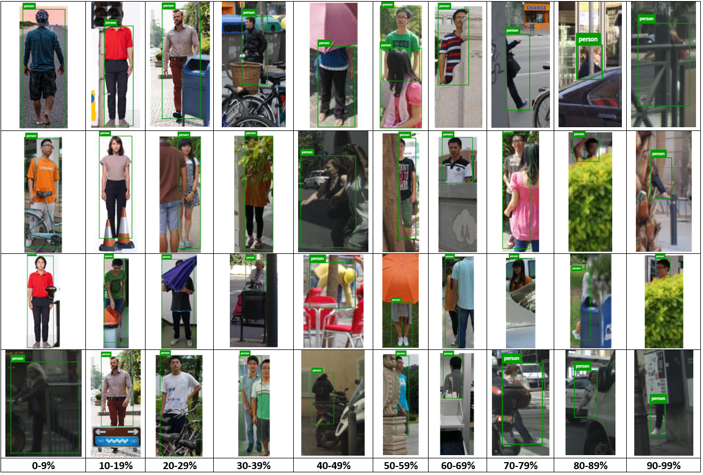

# Occluded Pedestrian Dataset

Partially Occluded Pedestrian Dataset used in ["Replacing the Human Driver: An Objective Benchmark for Occluded Pedestrian Detection"](https://arxiv.org/abs/2205.04812) Gilroy _et al_ 2023. 


 


This dataset contains 820 person instances in 724 images for the characterization of detection model performance for partially occluded pedestrians. Pedestrian instances are occluded by a diverse mix of objects across a range of occlusion levels from 0 to 99% occluded.

Images are annotated using the objective occlusion level annotation method described in [An objective method for pedestrian occlusion level classification](https://www.sciencedirect.com/science/article/pii/S0167865522003270) Gilroy _et al_ 2022.

Annotation files are in COCO format.


### Download Dataset Here
* [Occluded Pedestrian Dataset Download Link](https://drive.google.com/file/d/1hFRUdhXC92NdPbcanSDpEy8ZSvrSSZoV/view?usp=sharing)


### Please cite the following work

[Replacing the human driver: An objective benchmark for occluded pedestrian detection](https://www.sciencedirect.com/science/article/pii/S2667379723000293)
```
@article{gilroy2023replacing,
  title={Replacing the human driver: An objective benchmark for occluded pedestrian detection},
  author={Gilroy, Shane and Mullins, Darragh and Parsi, Ashkan and Jones, Edward and Glavin, Martin},
  journal={Biomimetic Intelligence and Robotics},
  pages={100115},
  year={2023},
  publisher={Elsevier}
}
```


[An objective method for pedestrian occlusion level classification](https://www.sciencedirect.com/science/article/pii/S0167865522003270)
```
@article{gilroy2022objective,
  title={An objective method for pedestrian occlusion level classification},
  author={Gilroy, Shane and Glavin, Martin and Jones, Edward and Mullins, Darragh},
  journal={Pattern Recognition Letters},
  volume={164},
  pages={96--103},
  year={2022},
  publisher={Elsevier}
}
```
